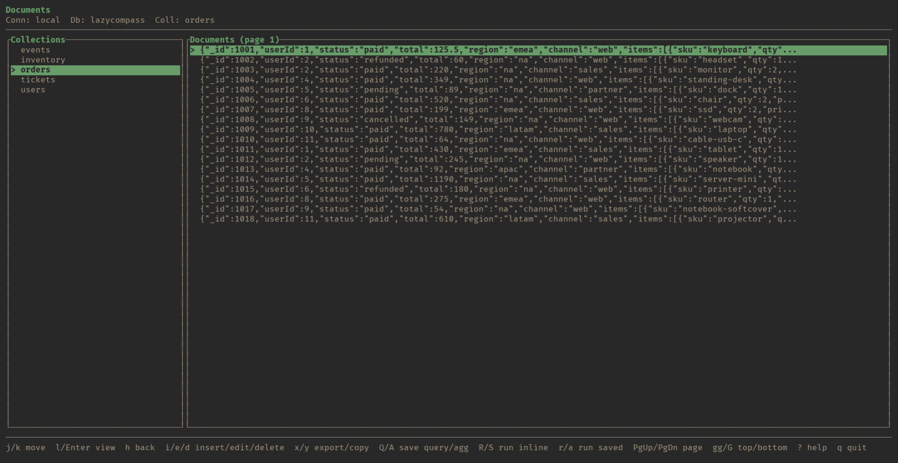
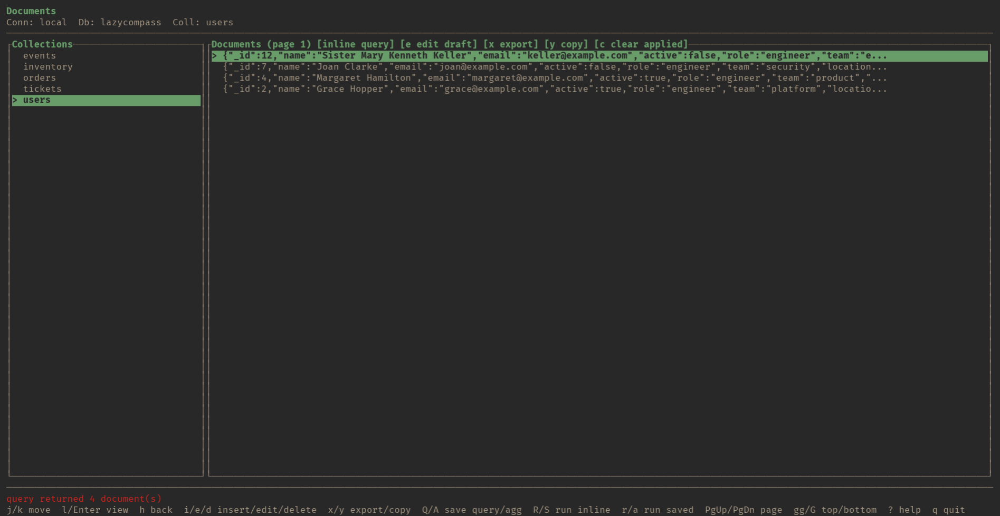
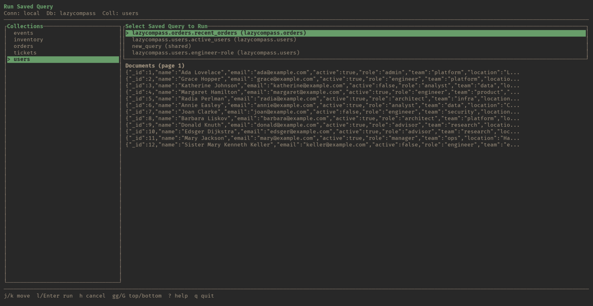
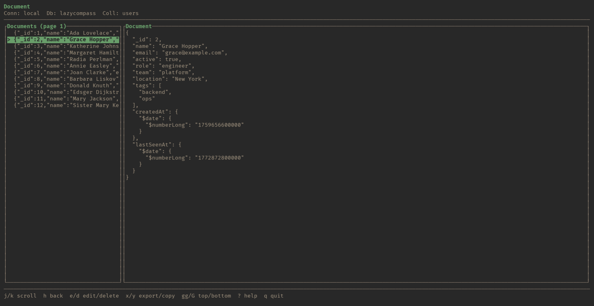
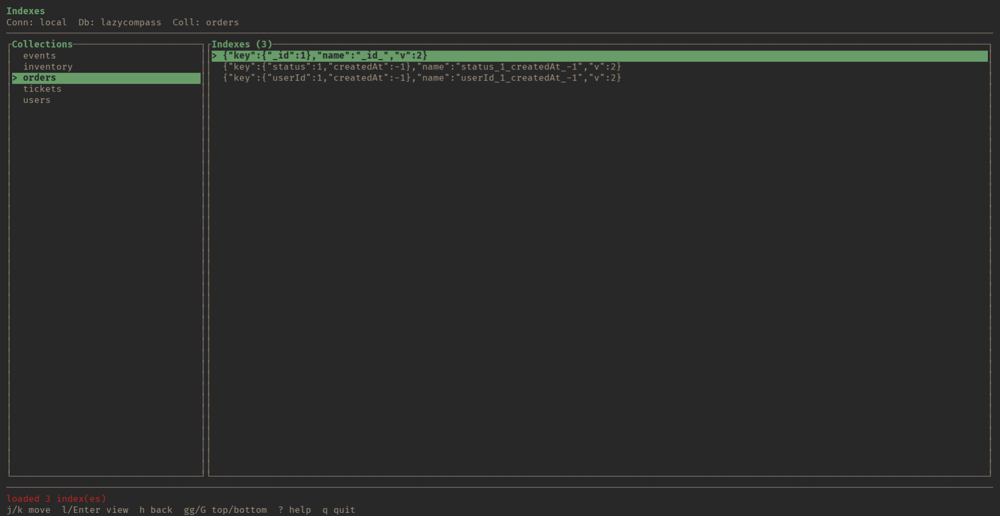
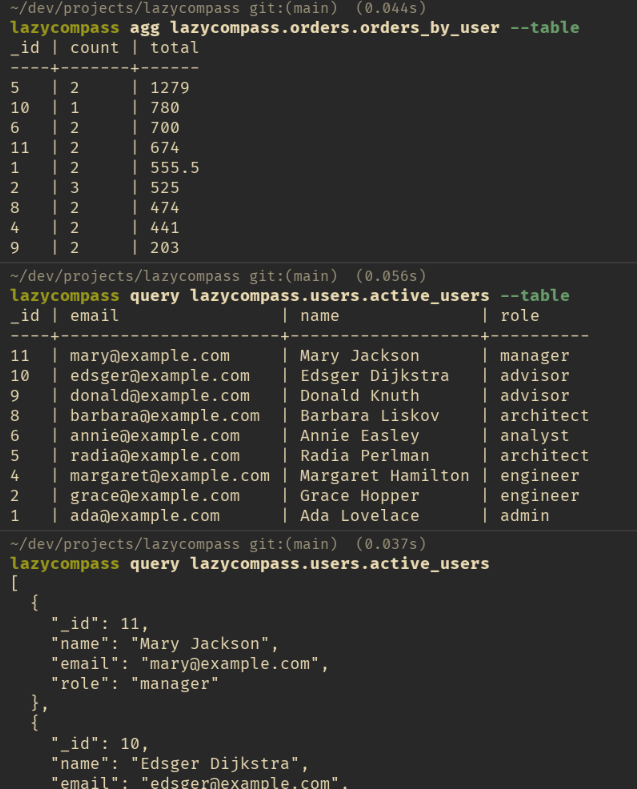

# LazyCompass

LazyCompass is a vim-first MongoDB client for the terminal.

It gives you a fast TUI for browsing data and a CLI for running saved or inline queries and aggregations. Queries and aggregations live as repo-committable JSON files, so teams can keep database workflows close to the codebase.

> LazyCompass is an independent open-source project and is not affiliated with or endorsed by MongoDB, Inc.

## Why LazyCompass

- TUI-first workflow for browsing databases, collections, documents, and indexes
- CLI subcommands for scripting queries, aggregations, and exports
- Saved queries and aggregations stored in git-friendly repo files
- Safer default runtime: MongoDB writes are opt-in per session
- Repo-local config with optional global fallback
- JSON, CSV, and table output for terminal, files, and clipboard

## Quick Look



Browse collections and scan real documents without leaving the terminal.

| Inline query results | Saved queries |
| --- | --- |
|  |  |
| Run ad-hoc filters and keep the result set in context. | Reuse repo-local queries directly from the TUI. |

| Document detail | Indexes |
| --- | --- |
|  |  |
| Inspect full documents when you need field-level detail. | Check collection indexes without dropping to the shell. |

Other captures and notes live in [assets/readme/README.md](./assets/readme/README.md).

## Installation

Prebuilt binaries are published on GitHub Releases for:

- Linux x64 (glibc)
- macOS x64
- macOS arm64
- Windows x64 (`beta`)

Install with the repo script:

```bash
./install.sh
```

Or fetch it directly:

```bash
curl -fsSL https://raw.githubusercontent.com/lucasscarioca/lazycompass/main/install.sh | bash
```

On Windows, use a GitHub Releases zip or install from source with Cargo. The shell installer is Unix-only.
The Unix installer requires `curl`, `tar`, and either `sha256sum` or `shasum`. If `gpg` is installed and the release ships a signature, the installer verifies it against the bundled LazyCompass release key.

Install from source with Cargo:

```bash
cargo install --path . -p lazycompass --locked
```

Upgrade an installed binary:

```bash
lazycompass upgrade
```

`lazycompass upgrade` downloads the matching release archive and verifies checksums. If `gpg` is installed and the release ships a signature, it also verifies the checksum signature against the bundled LazyCompass release key. Windows x64 support is currently `beta`; use a GitHub Releases zip or `--from-source` there instead of self-upgrade.

For manual verification and signing details, see [SECURITY.md](./SECURITY.md). Signed releases use [keys/lazycompass-release-signing.asc](./keys/lazycompass-release-signing.asc).

## Quick Start

Inside a repo:

```bash
lazycompass init
```

That creates or updates `.lazycompass/config.toml` and adds a connection with 3 prompts:

1. MongoDB URI
2. Optional default database
3. Connection name

If you prefer editing a template in `$VISUAL` or `$EDITOR`:

```bash
lazycompass init --editor
```

Example config:

```toml
[[connections]]
name = "primary"
uri = "${MONGO_URI}"
default_database = "app"
```

Set the referenced environment variable:

```bash
export MONGO_URI='mongodb://localhost:27017/app'
```

Or put it in a repo-root `.env`:

```dotenv
MONGO_URI=mongodb://localhost:27017/app
```

Start the TUI:

```bash
lazycompass
```

Start a write-enabled session:

```bash
lazycompass --dangerously-enable-write
```

`--dangerously-enable-write` only enables MongoDB write operations. Local actions like saving queries, editing config, exporting results, and clipboard copy remain available without it.

## Core Workflows

Run a saved query or aggregation:

```bash
lazycompass query app.users.active_users
lazycompass agg app.orders.orders_by_user --table
lazycompass query recent_orders --db app --collection orders
lazycompass query recent_orders --db app --collection orders --csv -o results.csv
```

Run an inline query or aggregation:

```bash
lazycompass query --db app --collection users --filter '{"active": true}'
lazycompass agg --db app --collection orders --pipeline '[{"$group":{"_id":"$userId","total":{"$sum":"$total"}}}]'
```

Use the connection default database to omit `--db`:

```bash
lazycompass query --collection users --filter '{"active": true}'
lazycompass agg recent_orders --collection orders
```

Pipe or save CLI output:

```bash
lazycompass query --db app --collection users --filter '{"active": true}' | jq .
lazycompass agg recent_orders --collection orders --table > report.txt
lazycompass indexes --db app --collection users --table
```



Use the CLI for saved queries, table output, and script-friendly JSON runs.

Inline query, aggregation, and write payloads accept normal JSON plus `ObjectId("...")` and
`ISODate("...")` input sugar. LazyCompass normalizes saved and reopened payloads back to valid
Extended JSON.

Manage config and data:

```bash
lazycompass config edit
lazycompass config add-connection
lazycompass config add-connection --editor
lazycompass --dangerously-enable-write insert --collection users --document '{"email":"a@example.com"}'
lazycompass --dangerously-enable-write update --collection users --id '{"$oid":"64e1f2b4c2a3e02c9a0a9c10"}' --document '{"email":"a@example.com","active":true}'
```

## TUI Highlights

- Browse connections, databases, collections, documents, and indexes
- Run saved queries and aggregations from the TUI
- Draft inline queries and aggregations, then rerun or save them
- Export applied results as JSON, CSV, or table text
- Copy results to the clipboard with native clipboard support or OSC52 fallback

Useful keys:

- Documents: `i` insert, `e` edit, `d` delete, `x` export, `y` copy, `Q` save query, `A` save aggregation, `r` run saved query, `a` run saved aggregation
- Collections: `I` list indexes
- Connections: `n` add connection

## Safety Model

- MongoDB write operations are disabled by default on every run
- Use `--dangerously-enable-write` or `--yolo` to enable writes for the current session
- Use `--allow-pipeline-writes` with write mode to allow `$out` and `$merge`
- Insecure Mongo connections are rejected by default unless `--allow-insecure` is set
- Query and aggregation execution stops after 10,000 result documents

MongoDB write actions open `$VISUAL` or `$EDITOR` for JSON editing. Editors accept normal JSON plus
`ObjectId("...")` and `ISODate("...")`, then normalize back to valid Extended JSON when saved.
Editor commands are parsed as command plus args only, without shell expansion.

## Configuration and Saved Specs

LazyCompass loads config from:

- `~/.config/lazycompass/config.toml`
- `.lazycompass/config.toml`

Repo config overrides global config. Saved queries and aggregations live in repo files:

- `.lazycompass/queries/*.json`
- `.lazycompass/aggregations/*.json`

Details:

- [CONFIGURATION.md](./CONFIGURATION.md)
- [QUERY_FORMAT.md](./QUERY_FORMAT.md)

## Docs

- [CONFIGURATION.md](./CONFIGURATION.md)
- [QUERY_FORMAT.md](./QUERY_FORMAT.md)
- [VERSIONING.md](./VERSIONING.md)
- [RELEASE.md](./RELEASE.md)
- [SECURITY.md](./SECURITY.md)
- [CODE_OF_CONDUCT.md](./CODE_OF_CONDUCT.md)
- [SUPPORT.md](./SUPPORT.md)
- [CHANGELOG.md](./CHANGELOG.md)
- [dev/qa/README.md](./dev/qa/README.md)

## Stability

Current tagged releases are still pre-`1.0`. The target `1.x` contract is stable on Linux and macOS, while Windows remains `beta`; see [VERSIONING.md](./VERSIONING.md) and [CHANGELOG.md](./CHANGELOG.md).

## Contributing

See [CONTRIBUTING.md](./CONTRIBUTING.md).

## License

MIT. See `LICENSE`.
